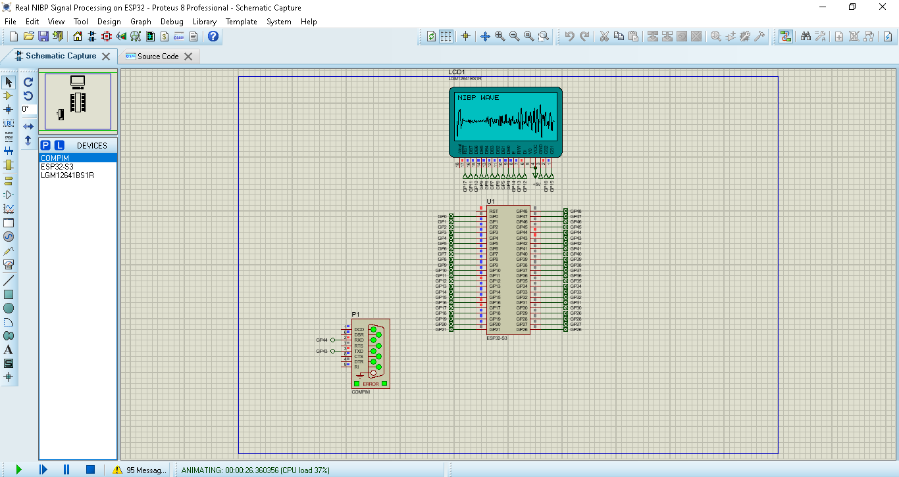

# NIBP Signal Processing on ESP32

Embedded oscillometric NIBP signal-processing project implemented on ESP32 with MicroPython and validated in Proteus.

## Overview

This project implements an oscillometric blood-pressure signal-processing pipeline on an ESP32.

The system receives pressure samples through UART, processes the signal digitally, extracts oscillometric pulses, builds the oscillometric envelope, estimates MAP/SBP/DBP, and displays the waveform and final result on a 128×64 GLCD.

## Processing Pipeline

Pressure samples
↓
UART reception
↓
Digital Butterworth band-pass filtering
↓
Absolute oscillometric peak detection
↓
Pulse validation
↓
Deflation detection
↓
Pressure reversal removal
↓
Amplitude outlier removal
↓
Oscillometric envelope
↓
Savitzky-Golay smoothing
↓
MAP estimation
↓
SBP / DBP estimation
↓
GLCD waveform and result display

## Current Validation

The current reference dataset contains 177 samples at 5 Hz.

Validated results:

* Detected peaks: 33
* Valid pulses: 24
* Final pulses: 13
* Envelope points: 13
* MAP: 101 mmHg
* SBP: 122 mmHg
* DBP: 86 mmHg
* Final system validation: PASS

## Project Files

### `main.py`

ESP32 MicroPython firmware containing the complete NIBP signal-processing pipeline and GLCD display logic.

### `test_sender_uart.py`

PC-side Python test transmitter used to send the test pressure data to the ESP32 through UART.

### `Real NIBP Signal Processing on ESP32.pdsprj`

Proteus simulation project used to test the ESP32-based NIBP processing system.

## Hardware / Simulation

* ESP32
* MicroPython
* 128×64 GLCD
* UART
* Proteus

## Proteus Simulation

## GLCD Result

## Validation Status

The current implementation has been tested in Proteus using the reference dataset.

The complete processing pipeline currently passes the project validation checks.

## Important Note

This project is an engineering and simulation implementation of an oscillometric NIBP processing algorithm.

The reported blood-pressure values are algorithmic outputs for the supplied test dataset and should not be considered clinically validated measurements or used for medical diagnosis.
